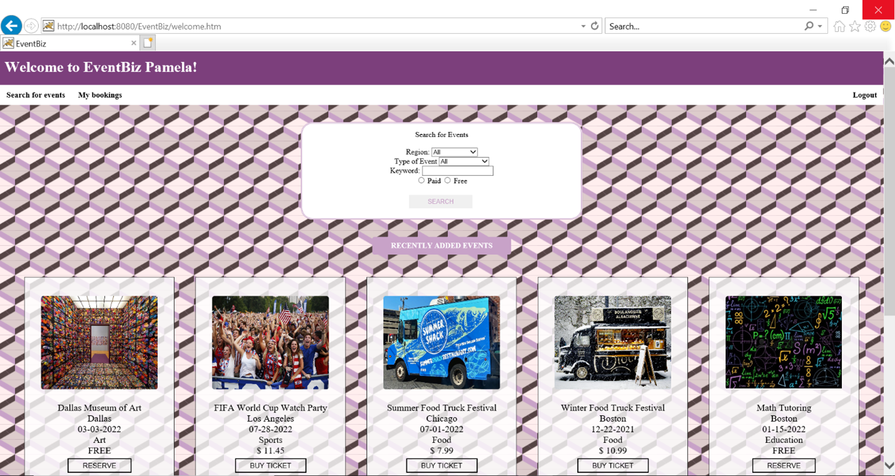
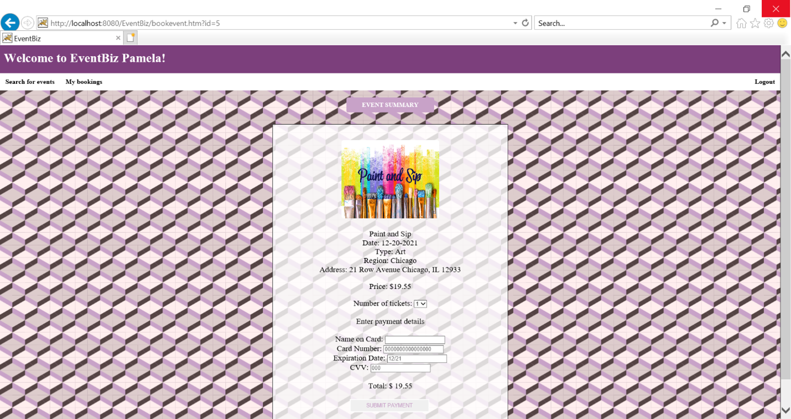
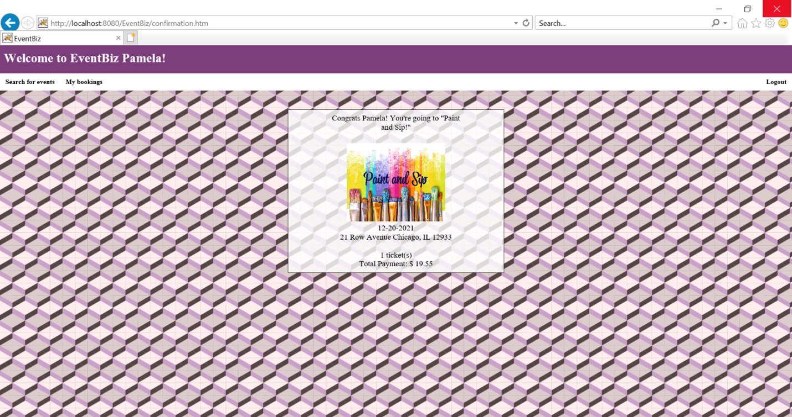
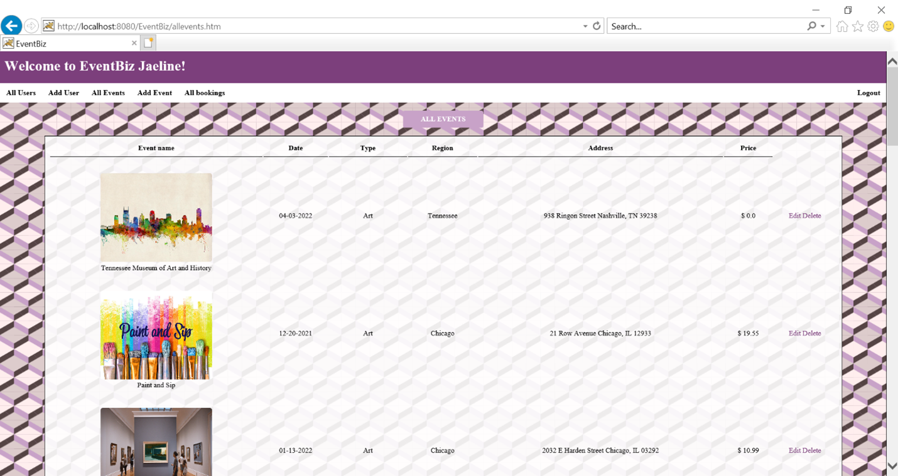
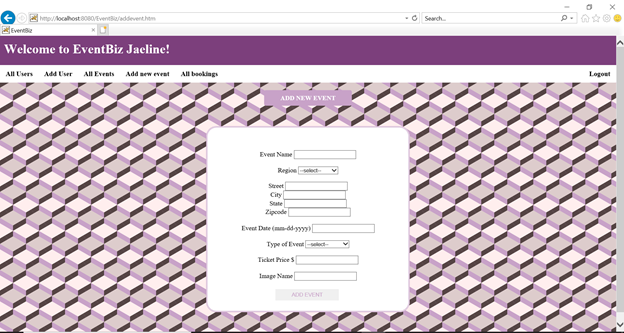

Creator: Jaeline Granda

Project Name: EventBiz

Summary: EventBiz aims to create a platform for people to discover new events in their area and share their own events with the public. Users can search for events, reserve/buy tickets, create new events and check their bookings history.

Summary of Functionality:
- Login/Register user account
- Search for new events by region, type, keyword or free/paid
- View recently added events
- Reserve/buy tickets
- View bookings history
- View event details
- Create new events
- Successfully Logout
- Form/object validation implemented

Technologies Used:
-	Java EE
-	Spring MVC
-	Hibernate
-	JSP
-	JSTL
-	MySQL
-	jQuery
-	HTML
-	CSS

User Roles and Tasks:
1)	Customer:
- User can register new user account with username and password for future login
- View recently added events on homepage
- Search for events based on filters including region, event type, event keyword, and/or free/paid
- Reserve spot for free events or purchase tickets for paid events
- View recent purchases or bookings
- Click on bookings to view event details
- Logout of session

2)	Event Admin
- User can register new user account with username and password for future login
- View recently added events on homepage
- Search for events based on location(region), event type, event keyword, and free/paid
- View all corresponding events created
- Add new events with details including event name, date, region, event type, address, and price
- Delete/update events created
- View bookings of events with names of users that reserved/purchased
- Click on booking to view event details
- Delete existing bookings
- Logout of session

3)	Admin
- Login to account as admin
- View all events created and additional details (event info and creatorid)
- View all users and details
- Create new user accounts and manage these permissions
- Update/deactivate existing user accounts
- Create new events
- Update/delete existing events
- View booking information for all events including event details and attendee info
- Delete existing bookings
- Logout of session

